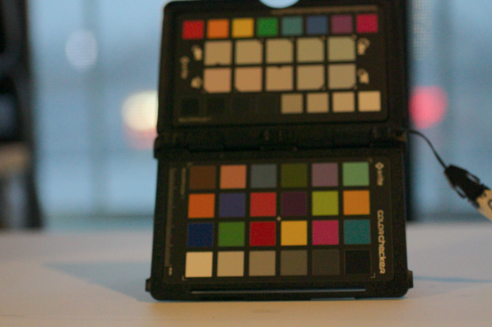

# Tiny DNG Loader

[](https://travis-ci.org/syoyo/tinydngloader)

Header-only simple&limited DNG(Digital NeGative, subset of TIFF format) loader in C++.

Currently TinyDNGLoader only supports lossless RAW DNG.


(NOTE: TinyDNGLoader just loads DNG data as is, thus you'll need your own RAW processing code(e.g. debayer) to get a developed image as shown the above)

## Features

* [x] RAW DNG data
* [x] Lossless JPEG
  * Experimental support. 16bit data only. Lossless JPEG decoding is supported through liblj92 lib. https://bitbucket.org/baldand/mlrawviewer.git

## Usage

```
#include <cstdio>
#include <cstdlib>
#include <iostream>

// Do this only one *.cc
#define TINY_DNG_LOADER_IMPLEMENTATION
#include "tiny_dng_loader.h"

int main(int argc, char **argv) {
  std::string input_filename = "colorchart.dng";

  if (argc > 1) {
    input_filename = std::string(argv[1]);
  }

  int width, height, bits, components;
  std::string err;
  tinydng::DNGInfo dng_info;
  std::vector<unsigned char> data;
  size_t data_len;

  bool ret = tinydng::LoadDNG(&dng_info, &data, &data_len, &width, &height,
                              &bits, &components, &err, input_filename.c_str());

  if (ret) {
    std::cout << "width = " << width << std::endl;
    std::cout << "height = " << height << std::endl;
    std::cout << "bits per piexl = " << bits << std::endl;
    std::cout << "# of components = " << components << std::endl;
    std::cout << "white_level = " << dng_info.white_level << std::endl;
    std::cout << "black_level = " << dng_info.black_level << std::endl;

    std::cout << "color_matrix = " << std::endl;
    for (size_t i = 0; i < 3; i++) {
      std::cout << dng_info.color_matrix[i][0] << " , "
                << dng_info.color_matrix[i][1] << " , "
                << dng_info.color_matrix[i][2] << std::endl;
    }

  } else {
    std::cout << "Fail to load DNG " << input_filename << std::endl;
    if (!err.empty()) {
      std::cout << "ERR: " << err;
    }
  }

  return EXIT_SUCCESS;
}

```

## Examples

* [examples/viewer](examples/viewer) Simple viewer example.


## TODO

* [ ] Parse more DNG headers
* [ ] Support DNG containing multiple images.
* [ ] Lossless JPEG other than 16bit.
  * Contribution is welcome.
* [ ] lossy JPEG DNG(CinemaDNG)
  * Contribution is welcome.
* [ ] ZIP-compressed DNG
  * Contribution is welcome.
* [ ] DNG writer?
* [ ] Support Big TIFF?(4GB+)

## License

TinyDNGLoader is licensed under MIT license.

TinyDNGLoader uses the following third party license(s).

* liblj92(Lossless JPEG library) : (c) Andrew Baldwin 2014. MIT license.  https://bitbucket.org/baldand/mlrawviewer.git

