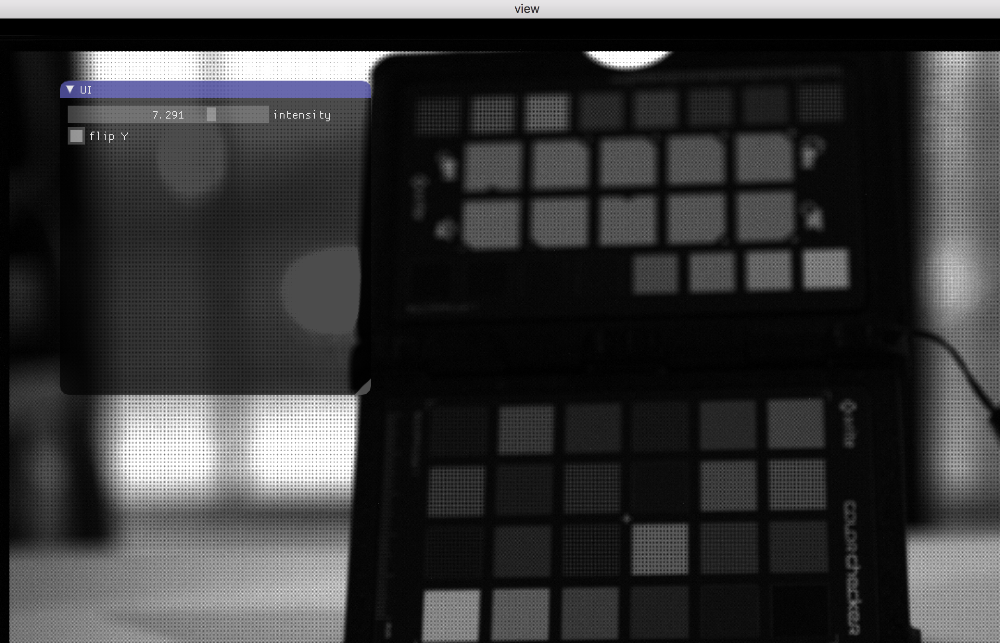

# Tiny DNG Loader and Writer library

[](https://travis-ci.org/syoyo/tinydngloader)

Header-only simple&limited DNG(Digital NeGative, TIFF format + extension) loader in C++03 and writer in C++11.

Currently TinyDNG only supports lossless RAW DNG and limited lossless JPEG DNG(no lossy compression support).

TinyDNG can also be used as an TIFF RGB image loader(8bit, 16bit and 32bit are supported).


(NOTE: TinyDNG just loads DNG data as is, thus you'll need your own RAW processing code(e.g. debayer) to get a developed image as shown the above)

## Features

### Loading

* [x] RAW DNG data
* [x] Lossless JPEG
  * Lossless JPEG decoding is supported based on liblj92 lib: https://bitbucket.org/baldand/mlrawviewer.git
* [x] ZIP-compressed DNG
  * Use miniz or zlib
* [x] JPEG
  * Support JPEG image(e.g. thumbnail) through `stb_image.h`.
* [x] TIFF
  * [x] 8bit uncompressed
  * [x] 8bit LZW compressed(no preditor, horizontal diff predictor)
* Experimental
  * Apple ProRAW(Lossless JPEG 12bit)
    * [x] Lossless JPEG 12bit
    * [x] Semantic map(8bit Standard JPEG)
  * Decode Canon RAW(CR2)
    * [x] RAW
    * [ ] mRAW
    * [ ] sRAW
  * Decode Nikon RAW(NEF)
    * TODO
  * Reading custom TIFF tags.
* [x] Read DNG data from memory.

### Writing

* [x] DNG and TIFF

## Supported DNG files

Here is the list of supported DNG files.

* [x] Sigma sd Quattro H
  * Uncompressed RGB 12bit image.
* [x] iPhone DNG
* [ ] Apple ProRAW
  * [x] Lossless JPEG 12bit
  * [x] Semantic map
* [x] Black magic DNG
  * CinemaDNG(lossy compression) is **not supported**.
* [x] Canon CR2(experimental)
  * Since CR2 format is also based on TIFF format : http://lclevy.free.fr/cr2/
  * RAW only(mRAW and sRAW are not supported)
* [x] Magic lantern DNG
  * [x] Uncompressed
  * [x] lossless JPEG(http://www.magiclantern.fm/forum/index.php?topic=18443.0)
* [ ] 8-bit TIFF image
  * [x] LZW compressed 8-bit image.
* [x] 16-bit uncompressed TIFF image
* [x] 32-bit uncompressed TIFF image
* OpCodeList
  * [x] GainMap

## Usage

### Loading DNG 

```c++
#include <cstdio>
#include <cstdlib>
#include <iostream>

// Define TINY_DNG_LOADER_IMPLEMENTATION and STB_IMAGE_IMPLEMENTATION in only one *.cc
#define TINY_DNG_LOADER_IMPLEMENTATION
#define STB_IMAGE_IMPLEMENTATION

// Enable ZIP compression(through miniz library)
// Please don't forget copying&adding `miniz.c` and `miniz.h` to your project.
// #define TINY_DNG_LOADER_ENABLE_ZIP

// Uncomment these two lines if you want to use system provided zlib library, not miniz
// #define TINY_DNG_LOADER_USE_SYSTEM_ZLIB
// #include <zlib.h>
#include "tiny_dng_loader.h"

int main(int argc, char **argv) {
  std::string input_filename = "colorchart.dng";

  if (argc > 1) {
    input_filename = std::string(argv[1]);
  }

  std::string warn, err;
  std::vector<tinydng::DNGImage> images;

  // List of custom field infos. This is optional and can be empty.
  std::vector<tinydng::FieldInfo> custom_field_lists;

  // Loads all images(IFD) in the DNG file to `images` array.
  // You can use `LoadDNGFromMemory` API to load DNG image from a memory.
  bool ret = tinydng::LoadDNG(input_filename.c_str(), custom_field_lists, &images, &warn, &err);


  if (!warn.empty()) {
    std::cout << "Warn: " << warn << std::endl;
  }

  if (!err.empty()) {
    std::cerr << "Err: " << err << std::endl;
  }

  if (ret) {
    for (size_t i = 0; i < images.size(); i++) {
      const tinydng::DNGImage &image = images[i];
;
      std::cout << "width = " << image.width << std::endl;
      std::cout << "height = " << image.height << std::endl;
      std::cout << "bits per piexl = " << image.bits_per_sample << std::endl;
      std::cout << "bits per piexl(original) = " << image.bits_per_sample_original << std::endl;
      std::cout << "samples per pixel = " << image.samples_per_pixel << std::endl;

    }
  }

  return EXIT_SUCCESS;
}

```

### Writing DNG(and TIFF)

See [examples/dngwriter](examples/dngwriter) and https://github.com/storyboardcreativity/zraw-decoder for more details.

```c++
#include <cassert>
#include <cstdio>
#include <cstdlib>
#include <iostream>

#define TINY_DNG_WRITER_IMPLEMENTATION
#include "tiny_dng_writer.h"

static void CreateRGBImage(tinydngwriter::DNGImage *dng_image,
                        const unsigned short basecol) {
  unsigned int image_width = 512;
  unsigned int image_height = 512;
  dng_image->SetSubfileType(false, false, false);
  dng_image->SetImageWidth(image_width);
  dng_image->SetImageLength(image_height);
  dng_image->SetRowsPerStrip(image_height);

  // SetSamplesPerPixel must be called before SetBitsPerSample()
  dng_image->SetSamplesPerPixel(3);
  uint16_t bps[3] = {16, 16, 16};
  dng_image->SetBitsPerSample(3, bps);
  dng_image->SetPlanarConfig(tinydngwriter::PLANARCONFIG_CONTIG);
  dng_image->SetCompression(tinydngwriter::COMPRESSION_NONE);
  dng_image->SetPhotometric(tinydngwriter::PHOTOMETRIC_RGB);
  dng_image->SetXResolution(1.0);
  dng_image->SetYResolution(1.2); // fractioal test
  dng_image->SetResolutionUnit(tinydngwriter::RESUNIT_NONE);
  dng_image->SetImageDescription("bora");

  std::vector<unsigned short> buf;
  buf.resize(image_width * image_height * 3);

  for (size_t y = 0; y < image_height; y++) {
    for (size_t x = 0; x < image_width; x++) {
      buf[3 * (y * image_width + x) + 0] = static_cast<unsigned short>(x % 512);
      buf[3 * (y * image_width + x) + 1] = static_cast<unsigned short>(y % 512);
      buf[3 * (y * image_width + x) + 2] = basecol;
    }
  }

  dng_image->SetImageData(reinterpret_cast<unsigned char *>(buf.data()),
                          buf.size() * sizeof(unsigned short));
}

int main(int argc, char **argv) {
  std::string output_filename = "output.dng";

  if (argc < 1) {
    std::cout << argv[0] << " <output.dng>" << std::endl;
  }

  if (argc > 1) {
    output_filename = std::string(argv[1]);
  }

  // TinyDNGWriter supports both BigEndian and LittleEndian TIFF.
  // Default = BigEndian.
  bool big_endian = false;

  if (argc > 2) {
    big_endian = bool(atoi(argv[2]));
  }

  {
    // DNGWriter supports multiple DNG images.
    // First create DNG image data, then pass it to DNGWriter with AddImage API.
    tinydngwriter::DNGImage dng_image0;
    dng_image0.SetBigEndian(big_endian);
    tinydngwriter::DNGImage dng_image1;
    dng_image1.SetBigEndian(big_endian);

    CreateRGBImage(&dng_image0, 12000);
    CreateRGBImage(&dng_image1, 42000);

    tinydngwriter::DNGWriter dng_writer(big_endian);
    bool ret = dng_writer.AddImage(&dng_image0);
    assert(ret);

    ret = dng_writer.AddImage(&dng_image1);
    assert(ret);

    std::string err;
    ret = dng_writer.WriteToFile(output_filename.c_str(), &err);

    if (!err.empty()) {
      std::cerr << err;
    }

    if (!ret) {
      return EXIT_FAILURE;
    }

    std::cout << "Wrote : " << output_filename << std::endl;
  }

  return EXIT_SUCCESS;
}
```

## Customizations

* `TINY_DNG_LOADER_USE_THREAD` : Enable threaded loading(requires C++11)
* `TINY_DNG_LOADER_ENABLE_ZIP` : Enable decoding AdobeDeflate image(Currently, tiled RGB image only).
  * `TINY_DNG_LOADER_USE_SYSTEM_ZLIB` : Use system's zlib library instead of miniz.
* `TINY_DNG_NO_EXCEPTION` : disable C++ exception(abort the program when got an assertion)
* `TINY_DNG_LOADER_DEBUG` : Enable debug printf(developer only!)

## Examples

* [examples/custom_fields](examples/viewer) Write a DNG with custom TIFF field.
* [examples/viewer](examples/viewer) Simple viewer example with simple debayering.
* [examples/tiff_viewer](examples/tiff_viewer) Simple TIFF viewer example(assume TIFF RGB image stored in DNG).
* [examples/fptiff2exr](examples/fptiff2exr) 32bit float(SAMPLEFORMAT_IEEEFP) grayscale or RGB image to EXR converter.
* [examples/dng2exr](examples/dng2exr) Simple DNG to OpenEXR converter.
* [examples/dngwriter](examples/dngwriter) Simple DNG writer example.

* https://github.com/storyboardcreativity/zraw-decoder

## Fuzzing test

* [fuzzer](fuzzer/) Fuzzing test.

## Resource

Here is the list of great articles on how to decode RAW file and how to develop RAW image.

* Developing a RAW photo file 'by hand' - Part 1 http://www.odelama.com/photo/Developing-a-RAW-Photo-by-hand/
* Developing a RAW photo file 'by hand' - Part 2 http://www.odelama.com/photo/Developing-a-RAW-Photo-by-hand/Developing-a-RAW-Photo-by-hand_Part-2/
* Understanding What is stored in a Canon RAW .CR2 file, How and Why http://lclevy.free.fr/cr2/

## TODO

* [ ] Move to C++11.
* [ ] Parse semantic map tags in Apple ProRAW.
* [ ] Add DNG header load only mode
* [ ] Parse more DNG headers
* [ ] Parse more custom DNG(TIFF) tags
* [ ] lossy DNG
* [ ] Improve DNG writer
  * [ ] Support compression
* [ ] Support Big TIFF(4GB+)
* [ ] Decode Nikon RAW(NEF)
* [ ] Improve Canon RAW decoding
* [ ] Optimimze lossless JPEG decoding
* [ ] Delayed load of tiled image.

## License

TinyDNG is licensed under MIT license.

TinyDNG uses the following third party libraries.

* liblj92(Lossless JPEG library) : (c) Andrew Baldwin 2014. MIT license.  https://bitbucket.org/baldand/mlrawviewer.git
* stb_image : Public domain image loader.
* lzw.hpp : Author: Guilherme R. Lampert. Public domain LZW decoder.
* miniz : Copyright 2013-2014 RAD Game Tools and Valve Software. Copyright 2010-2014 Rich Geldreich and Tenacious Software LLC MIT license. See `miniz.LICENSE`

