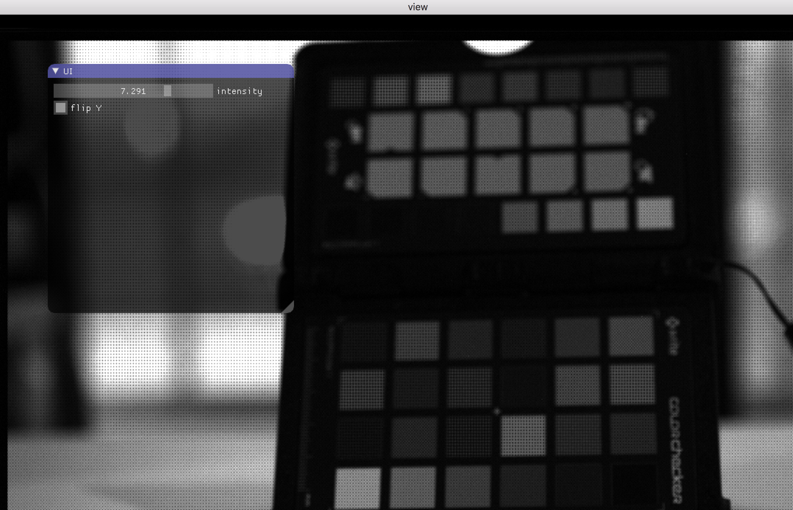

# Tiny DNG Loader and Writer library

Pure C11 DNG/TIFF/PSD loader and writer. Single public header (`tinydng.h`).

TinyDNG supports lossless RAW DNG, lossless JPEG, ZIP/Deflate, LZW, PackBits
compression, tiled and multi-strip layouts, multi-threaded decode, PSD/PSB
composite and layer decode, and streaming write to file or memory.

TinyDNG can also be used as a TIFF RGB image loader (8, 16 and 32 bit).


(NOTE: TinyDNG just loads DNG data as is, thus you'll need your own RAW processing code(e.g. debayer) to get a developed image as shown the above)

## Features

### Loading

* [x] RAW DNG data
* [x] Lossless JPEG (streaming decode, no full-segment materialization)
* [x] Baseline/progressive JPEG (via stb_image)
* [x] ZIP-compressed DNG (via vendored miniz)
* [x] LZW compressed TIFF
* [x] PackBits compressed TIFF
* [x] PSD / PSB (Adobe Photoshop)
  * [x] Composite image decode through the normal `tinydng_decode_*` APIs
  * [x] Layers, layer channels, masks, blend modes, groups and tagged blocks
  * [x] RAW, RLE(PackBits), ZIP and ZIP-with-prediction channel data
  * [x] 1, 8, 16 and 32 bit depths
  * [x] Image resources and JPEG thumbnail resources
  * [x] Embedded smart objects (PSD/PSB/TIFF/DNG/JPEG/PNG payloads)
* [x] Region decode (decode only a sub-region of an image)
* [x] Multi-threaded segment decode (POSIX / Win32 threads)
* [x] Custom TIFF field extraction
* [x] EXIF, CFA pattern, raw metadata, gainmaps, opcodes
* [x] Read from file, memory buffer, or memory-mapped I/O
* [x] BigTIFF (64-bit offsets)

* Experimental
  * Apple ProRAW (Lossless JPEG 12bit)
    * [x] Lossless JPEG 12bit
    * [x] Semantic map (8bit Standard JPEG)
  * Decode Canon RAW (CR2)
    * [x] RAW
    * [ ] mRAW
    * [ ] sRAW
  * [x] DNG quick header check (`tinydng_is_dng` / `tinydng_is_dng_memory`)

### Writing

* [x] DNG and TIFF
  * [x] Single-strip or tiled output
  * [x] Lossless JPEG, LZW, PackBits compression
  * [x] Streaming writer (writes tile/strip payloads incrementally)
* [x] PSD / PSB
  * [x] Composite image + layers
  * [x] RAW or RLE(PackBits) output
  * [x] 8, 16 and 32 bit depths
  * [x] Optional ICC profile resource

## Supported DNG files

* [x] Sigma sd Quattro H (uncompressed RGB 12bit)
* [x] iPhone DNG
* [x] Apple ProRAW (Lossless JPEG 12bit + Semantic map)
* [x] Black magic DNG (CinemaDNG lossy compression is **not supported**)
* [x] Canon CR2 (experimental, RAW only)
* [x] Magic lantern DNG (uncompressed + lossless JPEG)
* [x] 8-bit TIFF (LZW compressed)
* [x] 16-bit uncompressed TIFF
* [x] 32-bit uncompressed TIFF
* [x] OpCodeList GainMap

## Build

```bash
mkdir build && cd build
cmake .. -DCMAKE_BUILD_TYPE=Release
make -j$(nproc)
```

This builds the `tinydng` static library and test executables. No external
dependencies beyond a C11 compiler and pthreads (optional).

### Compile-time options

Define these to customize the build:

| Macro | Effect |
|-------|--------|
| `TINYDNG_NO_ZIP` | Compile out ZIP/Deflate support |
| `TINYDNG_NO_BASELINE_JPEG` | Compile out baseline/progressive JPEG support |
| `TINYDNG_NO_PSD` | Compile out PSD/PSB support |
| `TINYDNG_DISABLE_THREADS` | Build without multi-threaded decode |

## Usage

### Quick format check

```c
#include "tinydng.h"

int main(void) {
  tinydng_error err;
  if (tinydng_is_dng("photo.dng", &err) == TINYDNG_OK) {
    printf("valid DNG/TIFF\n");
  }
  return 0;
}
```

### Loading DNG

```c
#include <stdio.h>
#include <string.h>
#include "tinydng.h"

int main(int argc, char **argv) {
  tinydng_context *ctx;
  tinydng_document *doc = NULL;
  tinydng_error err;
  tinydng_open_options opts;
  const char *path = (argc > 1) ? argv[1] : "colorchart.dng";

  ctx = tinydng_context_create(NULL, &err);
  if (!ctx) { fprintf(stderr, "%s\n", err.message); return 1; }

  memset(&opts, 0, sizeof(opts));
  opts.flags = TINYDNG_OPEN_PARSE_SUBIFDS;

  if (tinydng_open_file(ctx, path, &opts, &doc, &err) != TINYDNG_OK) {
    fprintf(stderr, "%s\n", err.message);
    tinydng_context_destroy(ctx);
    return 1;
  }

  printf("images: %zu\n", tinydng_image_count(doc));

  const tinydng_exif *ex = tinydng_document_exif(doc);
  if (ex && ex->make) printf("make: %s\n", ex->make);
  if (ex && ex->model) printf("model: %s\n", ex->model);

  for (size_t i = 0; i < tinydng_image_count(doc); i++) {
    const tinydng_image_info *img = tinydng_image_get(doc, i);
    printf("image%zu: %ux%u spp=%u bps=%u comp=%u\n",
           i, img->width, img->height, img->samples_per_pixel,
           img->bits_per_sample, img->compression);
  }

  tinydng_document_destroy(ctx, doc);
  tinydng_context_destroy(ctx);
  return 0;
}
```

### Decoding pixels

```c
tinydng_pixels px;
tinydng_error derr;
if (tinydng_decode_image(ctx, doc, 0, NULL, &px, &derr) == TINYDNG_OK) {
  /* px.data contains decoded pixels; px.width, px.height, px.samples_per_pixel,
     px.bits_per_sample describe the buffer. */
  tinydng_pixels_free(ctx, &px);
}
```

### Writing DNG

```c
#include <string.h>
#include "tinydng.h"

int main(void) {
  tinydng_context *ctx;
  tinydng_error err;

  ctx = tinydng_context_create(NULL, &err);

  uint16_t pixels[256 * 256 * 3];
  /* fill pixel data ... */

  tinydng_write_image img;
  memset(&img, 0, sizeof(img));
  img.width = 256;
  img.height = 256;
  img.samples_per_pixel = 3;
  img.bits_per_sample = 16;
  img.sample_format = TINYDNG_SAMPLEFORMAT_UINT;
  img.data = (const uint8_t *)pixels;
  img.data_size = sizeof(pixels);

  tinydng_write_options opts;
  memset(&opts, 0, sizeof(opts));
  opts.big_endian = 0;
  opts.as_dng = 1;
  opts.compression = 7; /* lossless JPEG */

  tinydng_error werr;
  tinydng_status st = tinydng_write_file(ctx, "output.dng", &img, &opts, &werr);
  if (st != TINYDNG_OK) {
    fprintf(stderr, "write failed: %s\n", werr.message);
  }

  tinydng_context_destroy(ctx);
  return 0;
}
```

### Writing PSD/PSB

```c
tinydng_psd_write_doc doc;
tinydng_psd_write_options opts;

memset(&doc, 0, sizeof(doc));
doc.width = width;
doc.height = height;
doc.depth = 16;
doc.color_mode = TINYDNG_PSD_RGB;
doc.channel_count = 3;
doc.composite = rgb16_interleaved;
doc.composite_size = (size_t)width * height * 3 * 2;

memset(&opts, 0, sizeof(opts));
opts.compression = TINYDNG_PSD_COMP_RLE;

if (tinydng_psd_write_file(ctx, "out.psd", &doc, &opts, &err) != TINYDNG_OK) {
  fprintf(stderr, "%s\n", err.message);
}
```

### WebAssembly demo

The maintained browser build lives in [web](web/). It uses the v3 pure C API
to decode DNG/TIFF files in WebAssembly and includes a metadata/raw-development
demo with a WebGL2 tiled GPU path. Build it with an Emscripten environment:

```bash
emcmake cmake -S web -B web/build -DCMAKE_BUILD_TYPE=Release
cmake --build web/build
python3 -m http.server 8000
```

Open <http://localhost:8000/web/js/>.

## Testing

```bash
cd build && cmake .. && make -j$(nproc)
ctest
```

Test executables:

| Target | Description |
|--------|-------------|
| `test_dng_v3` | Smoke test (load + decode a DNG file) |
| `test_v3_roundtrip` | Write + re-read round-trip |
| `test_v3_decode` | Decode parity across formats |
| `test_v3_metadata` | Metadata parsing (EXIF, CFA, raw info, gainmaps) |
| `test_v3_security` | Fuzz-derived regression tests |
| `test_v3_mt` | Multi-threaded decode determinism |
| `test_v3_psd` | PSD/PSB writer-reader round trips |
| `test_v3_streamwrite` | Streaming tiled writer |

## Fuzzing

* [fuzzer](fuzzer/) - LLVM libFuzzer harnesses for v3.

## Deprecated APIs

The v1 C++ API (`tiny_dng_loader.h`, `tiny_dng_writer.h`) and the v2 C API
(`tiny_dng_v2.h`) are deprecated and have been moved to `attic/`. The v3 pure
C11 API in `tinydng.h` is the supported version. The lossless JPEG codec
(`tiny_dng_ljpeg92_v2.h/c`) is still used internally by v3 and is not
deprecated.

## Examples

See [examples/](examples/) for remaining examples. The deprecated v1 C++ examples
have been moved to `attic/examples/`.

## Python binding (Experimental)

Python bindings exist but currently use the deprecated v1 API. Contributions
to port them to v3 are welcome.

```
$ python -m pip install tinydng
```

## Resource

* Developing a RAW photo file 'by hand' - Part 1 http://www.odelama.com/photo/Developing-a-RAW-Photo-by-hand/
* Developing a RAW photo file 'by hand' - Part 2 http://www.odelama.com/photo/Developing-a-RAW-Photo-by-hand/Developing-a-RAW-Photo-by-hand_Part-2/
* Understanding What is stored in a Canon RAW .CR2 file, How and Why http://lclevy.free.fr/cr2/

## License

TinyDNG is licensed under MIT license.

TinyDNG uses the following third party libraries.

* liblj92(Lossless JPEG library) : (c) Andrew Baldwin 2014. MIT license.  https://bitbucket.org/baldand/mlrawviewer.git
* stb_image : Public domain image loader.
* miniz : Copyright 2013-2014 RAD Game Tools and Valve Software. Copyright 2010-2014 Rich Geldreich and Tenacious Software LLC MIT license. See `miniz.LICENSE`
